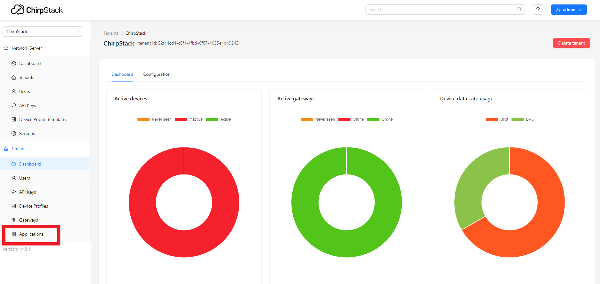
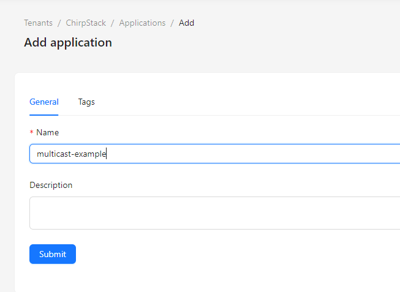
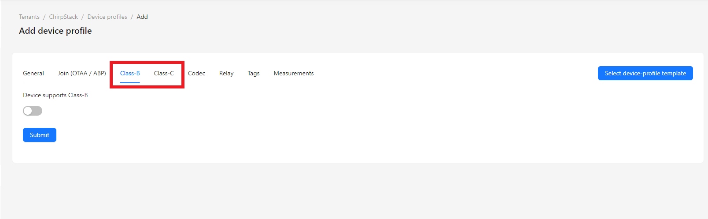
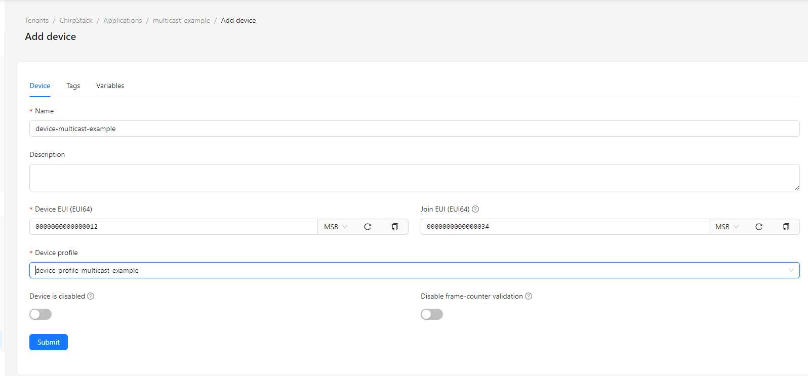
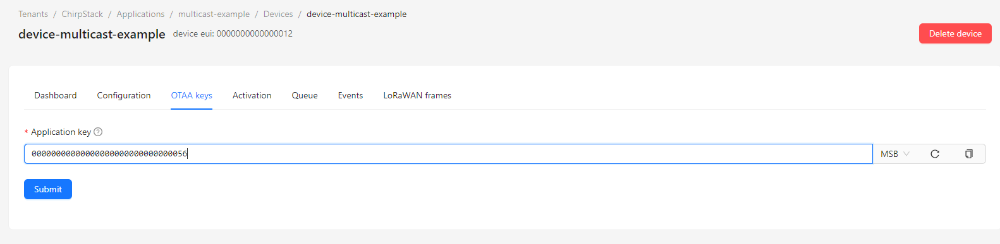
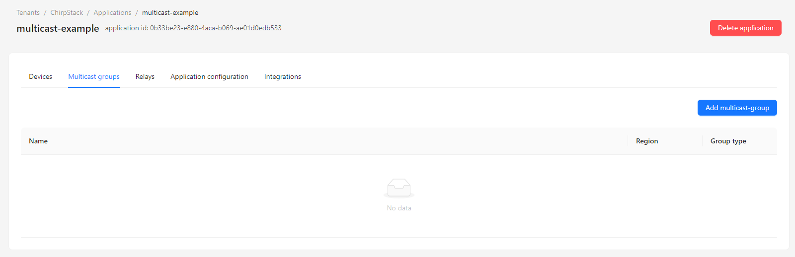
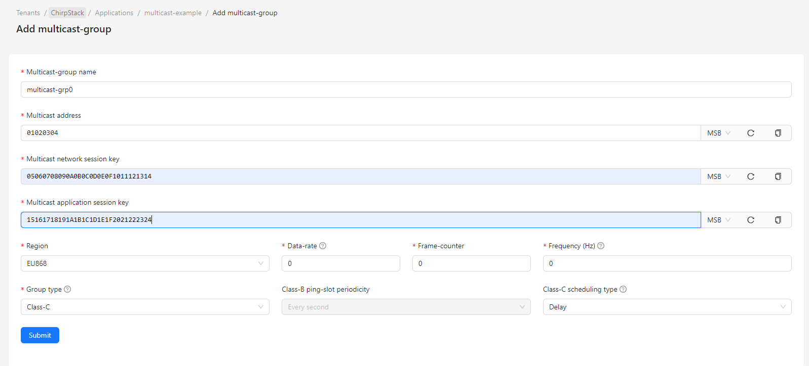
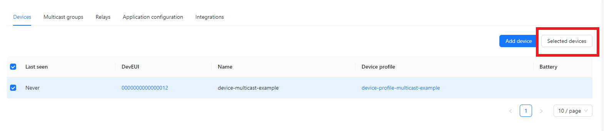
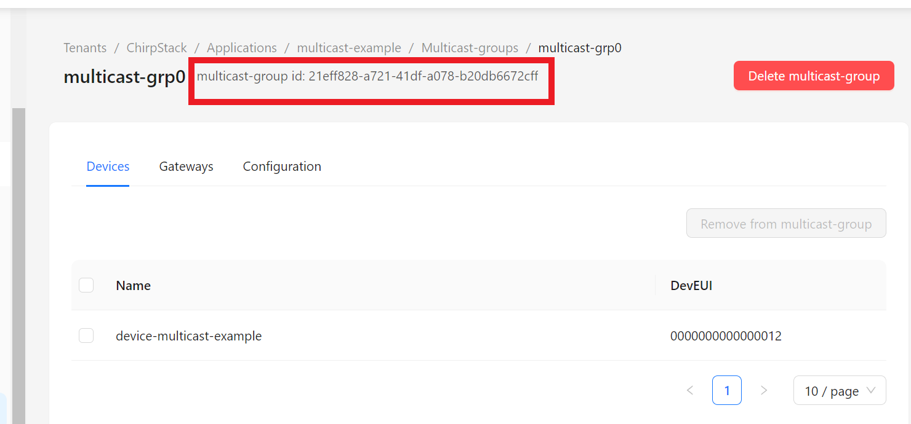

# LoRaWAN multicast Class B/C example

This example demonstrates how to set up and manage a multicast session using the LoRaWAN network.

## 1. Description

This application automatically submits a Join-Request to the LoRa Network Server. Once the join accept is received, the application sets up and manages one or two multicast sessions.

Pressing the NUCLEO blue button starts or stops the multicast session.

## 2. Configuration 

### 2.1. LoRaWAN configuration

Several constants are defined at the top of `main_multicast.c`, their values can be set to define the LoRaWAN configuration of the application.

| Constant              | Comments |
| --------------------- | -------- |
| `EXTI_BUTTON` | Pin name of the button. |
| `LORAWAN_APP_DATA_MAX_SIZE` | User application data buffer size. |
| `LORAWAN_REGION_USED` | LoRaWAN regulatory region. |

Supported values for `LORAWAN_REGION_USED`:

* `LR1121_LORAWAN_REGION_AS923_GRP1`
* `LR1121_LORAWAN_REGION_AS923_GRP2`
* `LR1121_LORAWAN_REGION_AS923_GRP3`
* `LR1121_LORAWAN_REGION_AS923_GRP4`
* `LR1121_LORAWAN_REGION_AU915`
* `LR1121_LORAWAN_REGION_CN470`
* `LR1121_LORAWAN_REGION_EU868 (default)`
* `LR1121_LORAWAN_REGION_IN865`
* `LR1121_LORAWAN_REGION_KR920`
* `LR1121_LORAWAN_REGION_RU864`
* `LR1121_LORAWAN_REGION_US915`

### 2.2 Multicast configuration

The application uses predefined multicast keys and parameters, which can be set in the source code.
| Constant              | Comments |
| --------------------- | -------- |
| `MULTICAST_KEYS` | Multicast session keys and group addresses. |
| `MULTICAST_FREQUENCY` | Multicast frequency per frequency plan. |
| `MULTICAST_DATARATE` | Multicast datarate per frequency plan. |
| `MULTICAST_PING_SLOT_PERIODICITY` | Ping slot periodicity for Class B multicast sessions. |
| `MULTICAST_SESSION_CLASS` | LoRaWAN multicast session class. |
| `NUMBER_MULTICAST_SESSION` | Number of multicast sessions (1 or 2). |

Supported values for `MULTICAST_SESSION_CLASS`:

* `LORAWAN_CLASS_B`
* `LORAWAN_CLASS_C`

### 2.3. Join configuration

The LR1121 is pre-provisioned with a ChipEUI/DevEUI and a JoinEUI. The application will use these identifiers if the `USE_LR11XX_CREDENTIALS` from [lorawan_comissioning.h](Inc/apps/lorawan_commissioning/lorawan_commissioning.h) is set to true. 

Alternatively, you can provide your own EUIs in `Inc/apps/lorawan_commissioning/lorawan_commissioning.h` by setting `USE_LR11XX_CREDENTIALS` to false and changing the values of `LORAWAN_DEVICE_EUI`, `LORAWAN_JOIN_EUI`, `LORAWAN_NWK_KEY` and `LORAWAN_APP_KEY`.

## 3. Usage

### 3.1. Serial console

Information messages are displayed on the serial console, starting with the DevEUI, AppEUI/JoinEUI, and PIN that you might need to register your device with the LoRa Cloud Device Join service.
Then, information about the procedure for activating the class and multicast session is displayed.  

### 3.2. Network Server configuration (Chirpstack v4)


Here is a description for configuring a Network Server ([Chirpstack v4](https://www.chirpstack.io/docs/index.html)) to send downlinks to multicast sessions.

1. On the main page of the Chirpstack web interface, go to "Applications".



2. Create an application by clicking on "Add application", entering the name of the application, and then clicking on "Submit".




3. Similarly, create a "device profile" in the corresponding tab. Enter a name for the device profile, configure the region, the MAC version, the regional parameters version, and enable the class you want to use for the multicast session in the Class B or Class C tab.



4. Now go to your application by clicking on "Applications" and then on the name you have given to your application. You can now create a device by clicking on "Add device" and filling in the fields (Name, Device EUI, Join EUI), selecting your Device profile, and then clicking on "Submit". At this stage, chirpstack should ask you "Application Key" for OTAA.




5. Return to the root of the application, click on the "Multicast-groups" tab, and then click on "Add multicast-group".



6. Fill in the information:

- Multicast group name ;
- Group address ;
- Multicast network session key ;
- Multicast application session key ;
- Region ;
- Group type.

You can leave data-rate and frequency (Hz) at 0 if you are using the default values in the application code.



7. Now we can associate the device with the multicast group by going back to the Devices tab, checking the device, then clicking on "Selected devices", "Add to multicast-group", and finally selecting the previously created multicast group.



8. In case you want 2 multicast sessions, you can repeat step 5 to 7

Your device and your multicast group are now created and associated.

### 3.3. Send downlink to multicast session

To be able to send downlink to the multicast session we provide a [python tool](../tools/chirpstack-downlink-multicast.py).

This script needs Python3, library [grpcio](https://pypi.org/project/grpcio/) and [chirpstack-api](https://pypi.org/project/chirpstack-api/). These libraries can be installed by running from the [tools](../tools/) directory

```
pip install -r requirements.txt
```

This script also needs the definition of several constants:

``` python
API_SERVER = "localhost" # Address of the Network Server
API_PORT = 8080          # API port of the Network Server
MULTICAST_GROUP_ID = "e84cd69a-2a05-4da0-8eb8-9122a43102ea"
FPORT= 10               # Fport of the downlink message
PAYLOAD = "010102020303040404"  # Payload of the downlink message
```


The `MULTICAST_GROUP_ID` can be found under Applications->[name of your application]->Multicast groups->[name of your multicast group]



An environment variable named `CHIRPSTACK_API_KEY` should be created and filled with an API key generated on the Web Interface of the Network Server, under tab "API keys"->"Add API key"

## 4. Miscellaneous

### 4.1. Application main loop

The application implements a relatively simple state machine based on the reception of events:

- Reset event: Configures the keys, the region, and starts the join procedure.
- Joined event: Configures the device class, sets up multicast sessions, and sends an uplink to activate the unicast session.
- TxDone event: Logs the transmission status.

Pressing the blue button toggles the multicast session on or off.

